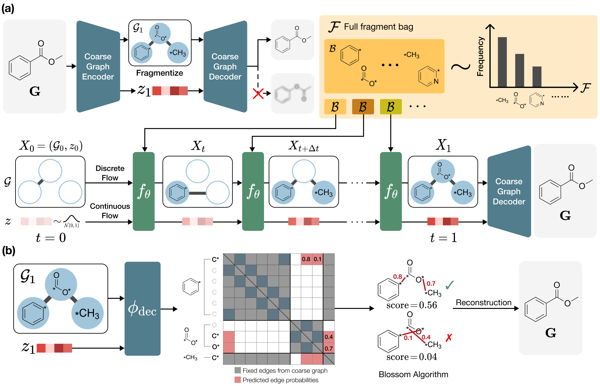
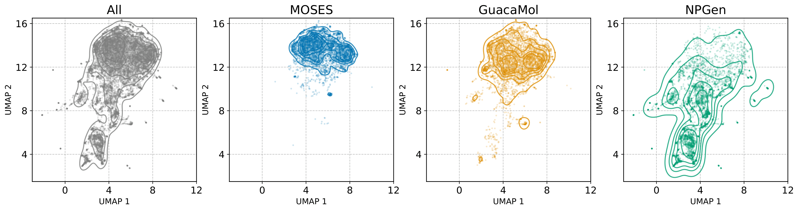
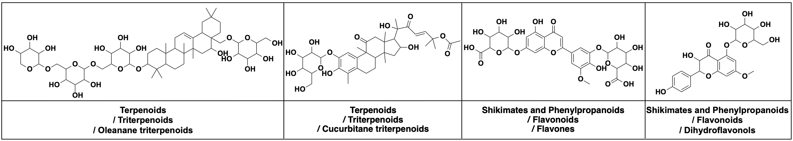

# FragFM: Hierarchical Framework for Efficient Molecule Generation via Fragment-Level Discrete Flow Matching

Official implementation of **FragFM: Hierarchical Framework for Efficient Molecule Generation via Fragment-Level Discrete Flow Matching** by Joongwon Lee<sup>&#42;</sup>, Seongwhan Kim<sup>&#42;</sup>, Seokhyun Moon<sup>&#42;</sup>, Hyeunwoo Kim<sup>†</sup>, and Woo Youn Kim<sup>†</sup>. \[[OpenReview](https://openreview.net/forum?id=tr6vRn2aPg)\] \[[arXiv](https://arxiv.org/abs/2502.15805)\]

> [!NOTE]
> This repository contains the official implementation of the **[FragFM Model](#fragfm-model)** and the **[NPGen Benchmark](#npgen-benchmark)** introduced in the paper.


# FragFM Model

**FragFM** is a hierarchical fragment-level discrete flow matching framework that generates molecular graphs via stochastic fragment bags and lossless coarse-to-fine atom-level reconstruction.




## Installation

To train and generate molecules with **FragFM**, install the required packages using the following script.

### Option 1: Conda Environment File (recommended)

```bash
conda env create -f environment.yaml
conda activate fragfm
```


### Option 2: Manual Conda + pip

```bash
conda create -n fragfm python=3.11 -y
conda activate fragfm
conda install scipy==1.14.1 numpy==1.26.4 pandas==2.2.3 scikit-learn==1.5.2 -y
pip install torch==2.1.0+cu118 -f https://download.pytorch.org/whl/torch_stable.html
pip install torch_geometric
pip install rdkit==2023.9.2
pip install git+https://github.com/bp-kelley/descriptastorus
pip install wandb==0.18.6 lmdb==1.5.1 pyyaml==6.0.1 easydict==1.13 parmap==1.7.0
pip install matplotlib==3.8.1 seaborn==0.13.0
pip install -e .
```


### Option 3: uv

```bash
curl -LsSf https://astral.sh/uv/install.sh | sh
uv venv -p 3.11
uv sync
source .venv/bin/activate
```


## Data and Checkpoints

We provide raw data, processed data, and checkpoints for `MOSES`, `GuacaMol`, `ZINC250k`, and `NPGen` benchmarks.
To generate molecules with FragFM, you will need the processed data along with the autoencoder and flow generator checkpoints.
Preprocessing only needs to be done once, but can take several hours (12+ hours depending on the dataset).
We recommend downloading the preprocessed data instead.

| Data | Size | Path |
| :- | :- | :- |
| [MOSES (Raw)](https://drive.google.com/uc?export=download&id=1kJpfMRwfo5RlsetDszBrERnBk0DvQD93) | 27MB | `data/raw/` |
| [GuacaMol (Raw)](https://drive.google.com/uc?export=download&id=1ON88EuFk1seVCjitINUPXfmODBwTz2L4) | 21MB | `data/raw/` |
| [ZINC250k (Raw)](https://drive.google.com/uc?export=download&id=18OTRyvfYLNA8ofYecqdmb1r2kFMy66rO) | 15MB | `data/raw/` |
| [NPGen (Raw)](https://drive.google.com/uc?export=download&id=1yZMzGpUYdG9vOhB5j8gLNcztE-4PmUoQ) | 12MB | `data/raw/` |
| [MOSES (Processed)](https://drive.google.com/uc?export=download&id=1KxQFlASOcK4KGX2Q0v3QTMJnPMCgoalN) | 706MB | `data/processed/` |
| [GuacaMol (Processed)](https://drive.google.com/uc?export=download&id=1hBFkLPQn7ZVOosWtqpXCDmIZc8p1HgI-) | 980MB | `data/processed/` |
| [ZINC250k (Processed)](https://drive.google.com/uc?export=download&id=15wVMkXDMVZ0UCflq08iR6VsZ2u7QQWsK) | 129MB | `data/processed/` |
| [NPGen (Processed)](https://drive.google.com/uc?export=download&id=1ldyqntL2uWUswZoJjpWi8mq3L2-jdr68) | 576MB | `data/processed/` |


| Checkpoint | Size | Path |
| :- | :- | :- |
| [Coarse-to-fine Autoencoders](https://drive.google.com/uc?export=download&id=19qJ1Dds1AkZHbLL6bIY-LeN0BsJCYQb9) | 94MB | `save/ae_model/` |
| [Flow Generators](https://drive.google.com/uc?export=download&id=17IzYwvqpcfQCY_1TJWG8yJzScUj51xBR) | 307MB | `save/flow_model/` |


## Data Preparation

You can run the script to process the data from scratch.
If you have already downloaded the processed data above, you can skip this step.
The following is an example for `moses`:

```bash
bash process/process_all_data.sh moses
```


## Training Models

The training consists of two steps: (1) training the coarse-to-fine autoencoder and (2) training the flow generator.
Configuration files are stored in `cfgs/`.


### Training the Coarse-to-Fine Autoencoder

To train the coarse-to-fine autoencoder, run the following.
The configuration and model checkpoints will be saved to `save/ae_model/`.

```bash
python exe/train_ae.py cfgs/train_ae/moses.yaml
```

Key options:

| Option | Description |
| :- | :- |
| `tag` | Experiment name; checkpoints saved to `save/ae_model/<time>_<tag>/` |
| `data_dirn` | Path to the processed LMDB file (e.g. `data/processed/moses_brics_all.lmdb`) |
| `latent_z_dim` | Dimension of the autoencoder latent space |


### Training the Flow Generator

To train the flow generator, run the following.
The configuration and model checkpoints will be saved to `save/flow_model/`.

```bash
python exe/train_flow.py cfgs/train_flow/moses.yaml
```

Key options:

| Option | Description |
| :- | :- |
| `tag` | Experiment name; checkpoints saved to `save/flow_model/<time>_<tag>/` |
| `data_dirn` | Path to the processed molecule LMDB file (e.g. `data/processed/moses_brics_all.lmdb`) |
| `frag_data_dirn` | Path to the processed fragment LMDB file (e.g. `data/processed/moses_brics_all_fragment.lmdb`) |
| `frag_smi_to_idx_fn` | Path to the fragment SMILES-to-index mapping pickle file (e.g. `data/processed/moses_brics_all_fragment_to_idx.pkl`)|
| `ae_model_dirn` | Path to the pretrained autoencoder directory (e.g. `save/ae_model/moses`) |


## Molecule Sampling

To generate molecules with FragFM, run the following.
The generated samples will be automatically saved to `save/generate` unless you set `force_save_fn` in the `.yaml` file.

```bash
python exe/generate.py cfgs/generate/moses.yaml
```

Key options:

| Option | Description |
| :- | :- |
| `tag` | Experiment name; results saved to `save/generate/<time>_<tag>/` |
| `force_save_dirn` | Override the output directory path (optional) |
| `data_dirn` | Path to the processed molecule LMDB file |
| `frag_data_dirn` | Path to the processed fragment LMDB file (e.g. `data/processed/moses_brics_all_fragment.lmdb`) |
| `frag_smi_to_idx_fn` | Path to the fragment SMILES-to-index mapping pickle file (e.g. `data/processed/moses_brics_all_fragment_to_idx.pkl`) |
| `fm_model_dirn` | Path to the trained flow generator directory (e.g. `save/flow_model/moses`) |
| `fragment_bag` | Fragment bag to sample from (`train`, `valid`, `test`) |
| `n_sample` | Number of molecules to generate |


## Conditional Generation

FragFM offers a conditional molecule generation scheme with fragment-bag and graph-level predictor guidance.
Conditional sampling builds on an unconditional generator: you must first train the lightweight graph-level property predictor described below.


### Training the Predictor

To train the predictor, run the following.
The configuration and model checkpoints will be saved to `save/disc_model/`.

```bash
python exe/train_disc.py cfgs/train_disc/moses_logp.yaml
```

Key options:

| Option | Description |
| :- | :- |
| `fm_model_dirn` | Path to the pretrained flow generator directory (e.g. `save/flow_model/moses`) |
| `calc_prop` | Molecular property to predict (`logp`, `nring`, `tpsa`, `qed`) |


### Molecule Sampling

Conditional sampling follows the same procedure as unconditional generation and can be performed by modifying the configuration in the `.yaml` file as follows.

```bash
python exe/generate.py cfgs/generate/moses_logp.yaml
```

Key options:

| Option | Description |
| :- | :- |
| `disc_model_dirn` | Path to the trained predictor directory (e.g. `save/disc_model/moses_logp`); set to enable conditional sampling |
| `guide_val` | Guidance target value for the predictor |
| `bag_guide_strength` | Strength of fragment-bag level guidance |
| `graph_guide_strength` | Strength of graph-level guidance |


# NPGen Benchmark

**NPGen** is a large-scale natural product generation benchmark designed to evaluate generative models on structurally complex and biologically meaningful chemical space beyond standard drug-like datasets, with molecular structures curated from the [COCONUT database](https://coconut.naturalproducts.net).






## Models

We evaluate against a diverse set of baseline models: a sequence-based model ([SAFE-GPT](https://pubs.rsc.org/en/content/articlelanding/2024/dd/d4dd00019f)), an atom-level graph autoregressive model ([GraphAF](https://arxiv.org/abs/2001.09382)), atom-level graph diffusion models ([DiGress](https://arxiv.org/abs/2209.14734), [DeFoG](https://arxiv.org/abs/2410.04263)), and fragment-level graph models ([MolHF](https://arxiv.org/abs/2305.08457), [JT-VAE](https://arxiv.org/abs/1802.04364), [HierVAE](https://arxiv.org/abs/2002.03230)).
We provide example molecules generated by each baseline model in `npgen-benchmark/baselines/`, where each file contains 30,000 SMILES strings of generated molecules.

<div style="overflow-x: auto;">
<table style="white-space: nowrap; width: max-content;">
  <thead>
    <tr>
      <th nowrap rowspan="2" style="border-bottom: 2px solid">Model</th>
      <th nowrap rowspan="2" style="border-bottom: 2px solid">Val.&nbsp;(↑)</th>
      <th nowrap rowspan="2" style="border-bottom: 2px solid">Unique.&nbsp;(↑)</th>
      <th nowrap rowspan="2" style="border-bottom: 2px solid">Novel&nbsp;(↑)</th>
      <th nowrap rowspan="2" style="border-bottom: 2px solid">NP&nbsp;Score&nbsp;(↓)</th>
      <th nowrap colspan="3" align="center">NPClassifier&nbsp;(↓)</th>
      <th nowrap rowspan="2" style="border-bottom: 2px solid">FCD&nbsp;(↓)</th>
    </tr>
    <tr>
      <th nowrap style="border-bottom: 2px solid">Pathway</th>
      <th nowrap style="border-bottom: 2px solid">Superclass</th>
      <th nowrap style="border-bottom: 2px solid">Class</th>
    </tr>
  </thead>
  <tbody>
    <tr>
      <td nowrap style="border-bottom: 2px solid"><a href="npgen-benchmark/baselines/safegpt.smi">SAFE&#8209;GPT</a>&nbsp;<i>(Sequence)</i></td>
      <td nowrap align="right" style="border-bottom: 2px solid">96.5</td><td nowrap align="right" style="border-bottom: 2px solid">98.6</td><td nowrap align="right" style="border-bottom: 2px solid">73.5</td>
      <td nowrap align="right" style="border-bottom: 2px solid">0.0024</td><td nowrap align="right" style="border-bottom: 2px solid">0.0054</td><td nowrap align="right" style="border-bottom: 2px solid">0.0414</td><td nowrap align="right" style="border-bottom: 2px solid">0.1722</td>
      <td nowrap align="right" style="border-bottom: 2px solid">0.15</td>
    </tr>
    <tr>
      <td nowrap><a href="npgen-benchmark/baselines/graphaf.smi">GraphAF</a>&nbsp;<i>(Graph-Atom)</i></td>
      <td nowrap align="right">79.1</td><td nowrap align="right">63.6</td><td nowrap align="right">95.6</td>
      <td nowrap align="right">0.8546</td><td nowrap align="right">0.9713</td><td nowrap align="right">3.3907</td><td nowrap align="right">6.6905</td>
      <td nowrap align="right">25.11</td>
    </tr>
    <tr>
      <td nowrap><a href="npgen-benchmark/baselines/digress.smi">DiGress</a>&nbsp;<i>(Graph-Atom)</i></td>
      <td nowrap align="right">85.4</td><td nowrap align="right">99.7</td><td nowrap align="right">99.9</td>
      <td nowrap align="right">0.1957</td><td nowrap align="right">0.0229</td><td nowrap align="right">0.3770</td><td nowrap align="right">1.0309</td>
      <td nowrap align="right">2.05</td>
    </tr>
    <tr>
      <td nowrap style="border-bottom: 2px solid"><a href="npgen-benchmark/baselines/defog.smi">DeFoG</a>&nbsp;<i>(Graph-Atom)</i></td>
      <td nowrap align="right" style="border-bottom: 2px solid">85.9</td><td nowrap align="right" style="border-bottom: 2px solid">98.4</td><td nowrap align="right" style="border-bottom: 2px solid">99.2</td>
      <td nowrap align="right" style="border-bottom: 2px solid">0.1550</td><td nowrap align="right" style="border-bottom: 2px solid">0.1252</td><td nowrap align="right" style="border-bottom: 2px solid">0.4134</td><td nowrap align="right" style="border-bottom: 2px solid">1.3597</td>
      <td nowrap align="right" style="border-bottom: 2px solid">4.46</td>
    </tr>
    <tr>
      <td nowrap><a href="npgen-benchmark/baselines/jtvae.smi">JT&#8209;VAE</a>&nbsp;<i>(Graph-Fragment)</i></td>
      <td nowrap align="right">100.0</td><td nowrap align="right">97.2</td><td nowrap align="right">99.5</td>
      <td nowrap align="right">0.5437</td><td nowrap align="right">0.1055</td><td nowrap align="right">1.2895</td><td nowrap align="right">2.5645</td>
      <td nowrap align="right">4.07</td>
    </tr>
    <tr>
      <td nowrap><a href="npgen-benchmark/baselines/hiervae.smi">HierVAE</a>&nbsp;<i>(Graph-Fragment)</i></td>
      <td nowrap align="right">100.0</td><td nowrap align="right">81.5</td><td nowrap align="right">97.7</td>
      <td nowrap align="right">0.3021</td><td nowrap align="right">0.4230</td><td nowrap align="right">0.5771</td><td nowrap align="right">1.4073</td>
      <td nowrap align="right">8.95</td>
    </tr>
    <tr>
      <td nowrap><a href="npgen-benchmark/baselines/molhf.smi">MolHF</a>&nbsp;<i>(Graph-Fragment)</i></td>
      <td nowrap align="right">71.0</td><td nowrap align="right">59.6</td><td nowrap align="right">97.6</td>
      <td nowrap align="right">0.8831</td><td nowrap align="right">1.8072</td><td nowrap align="right">9.1608</td><td nowrap align="right">10.3760</td>
      <td nowrap align="right">31.26</td>
    </tr>
    <tr>
      <td nowrap><a href="npgen-benchmark/baselines/fragfm.smi">FragFM</a>&nbsp;<i>(Graph-Fragment)</i></td>
      <td nowrap align="right">98.0</td><td nowrap align="right">99.0</td><td nowrap align="right">95.4</td>
      <td nowrap align="right">0.0374</td><td nowrap align="right">0.0196</td><td nowrap align="right">0.1482</td><td nowrap align="right">0.3570</td>
      <td nowrap align="right">1.34</td>
    </tr>
  </tbody>
</table>
</div>


## Installation

>[!NOTE]
>We have tested the benchmark working on Ubuntu 22.04.2 and CentOS Linux release 7.9.2009.

>[!WARNING]
>RDKit version **must** be `2020.03.2`. Newer versions can change core logic and produce different results.
>Due to this strict RDKit requirement, Mac OS with ARM architecture cannot run this benchmark natively.
>PyPI-only packaging is not feasible because `rdkit==2020.03.2` is not reliably available as portable pip wheels across platforms.


### Option 1: Conda Environment File

```bash
conda env create -f npgen-benchmark/environment.yml
conda activate npgenbenchmark
```


### Option 2: Manual Conda + pip

```bash
conda create -n npgenbenchmark python=3.8
conda activate npgenbenchmark
conda install -c conda-forge numpy=1.21 rdkit=2020.03.2 icu=68.2
pip install pandas huggingface_hub scikit-learn scipy tqdm torch fcd_torch
pip install -e .
```


### Option 3: Pixi

A Pixi config is provided in `pixi.toml` for reproducible setup.

Use `pixi.lock` for fully reproducible environments:
- If `pixi.lock` is already in the repo, install exactly that environment.
- Use `--frozen` to avoid lockfile changes during install.

```bash
pixi install --frozen
pixi run pip-deps
```

When dependencies in `pixi.toml` change, update the lockfile explicitly:

```bash
pixi lock
pixi install
pixi run pip-deps
```

Run Python commands directly in the Pixi environment:
```bash
pixi run python npgen-benchmark/tests/test_benchmark.py
```

Then start a shell in the environment:
```bash
pixi shell
```

For Apple Silicon Macs, use an x86_64/Rosetta terminal when running this project.


## Benchmark Evaluation

> [!IMPORTANT]
> `smiles_list` must contain at least 30,000 molecules.

Run benchmark experiments using the provided scripts:
```python
import torch
from npgenbenchmark import NPGenBenchmark

# define smiles list to benchmark (usually generated molecules)
# benchmark also includes calculation of validity
smiles_list = ["CCCC", "c1ccccc1", "X", "CCO", "X"]

benchmark = NPGenBenchmark(
    device="cuda:0" if torch.cuda.is_available() else "cpu",
    n_jobs=4,  # Adjust based on your system cores (num_workers in dataloader)
    batch_size=256,  # Example batch size
    verbose=True,
    n_eval_data=30000, # Number of data to evaluate
)

# Run the benchmark
results = benchmark.run_benchmark(smiles_list)
print(results)
```

For better convenience, we re-package the original [NP-Classifier](https://github.com/mwang87/NP-Classifier) code to use pytorch instead of Keras.
